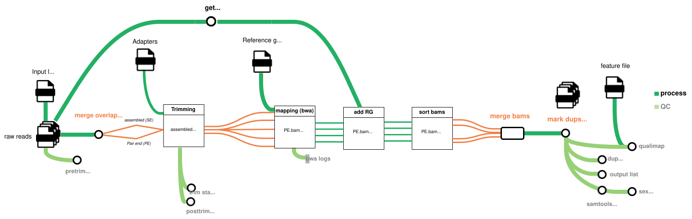

# fastq2bam_museum



This is a workflow for museum samples that automates processing of raw Illumina (short-reads) sequencing data from FASTQ to analysis-ready BAM files. This workflow was created following the original [fastq2bam](https://github.com/JGoudetGroup/fastq2bam?tab=readme-ov-file#) workflow developed by [Marianne Bachmann](https://github.com/m-bachmann), implementing a few modifications relevant to museum samples.


This workflow evaluates and trims raw illumina reads, identifying `paired-` an `unpaired-R1` and `-R2` reads, as well as merging overlapping-reads (a common outcome of short fragment sizes occurring in degraded DNA). Trimmed reads are mapped to a reference genome with proper read group tags added. Bam files obtained from the same library are merged generating a single `_mapped.bam` file. Finally, duplicates are marked resulting in a sorted analysis-ready `_marked.bam` file per library.

The pipeline also allows for quality control at each processing step from raw read assessment to the final duplicated-marked bam files, generating comprehensive QC reports and aggregating them via MultiQC.

## Running the pipeline

### 1. Environment setup

Before executing the pipeline, ensure your environment is properly configured:

- Nextflow depends on java and it needs to previously load java.

```bash
module load openjdk/17.0.8.1_1
```
 Note the software version as the default java in cluster is not compatible.

- You can access the centralized Python environment at:

```bash
/work/FAC/FBM/DEE/jgoudet/barn_owl/Common/venv/biopython
```

The `biopython` environment includes `pandas`, `Biopython` and `multiqc`. If you don't have access to the shared environment or are running elsewhere:

- Use the `bin/biopython_requirements.txt` file included in this repository.
- Create a local environment with it:

```bash
python3 -m venv $ENVNAME
source $ENVNAME/bin/activate
# Add required packages
pip install -r biopython_requirements.txt
```
Ensure you specify the path to this environment's `bin/activate` in the `params.json`.


### 2. Input files

The pipeline must be run with individuals sequenced on the **same instrument** (e.g. Novaseq) and with the same **library protocol** (e.g. Nextera or IDTxGen), this will determine the correct adapters to be trimmed as well as the assignment of read groups. This information should be specified in the `params.json` file and applies to all libraries equally. Memory, CPU and time allocation should be adjusted accordingly in the `nextflow.config` file. This workflow has been run in three different sets of museum samples and specifications on the individual changes for each set of samples are specified in their corresponding folder_scripts.

#### 2.1 FASTQ files

The FASTQ files are provided through **a comma separated file** containing:

|source_organism_id |specimen_id |lane | R1           | R2            |
|-------------------|------------|-----|--------------|---------------|
|Sample_ID             |Library name|lane |Path to read 1|Path to read 2 |

> While the source_organism_id is not needed for the naming of the file, it is required for the `SAMPLE`(`SM`) read group attribution. The library name does not always follow the same format, so it is not very flexible to add an automated extraction of the SampleID from the library name inside the pipeline.

#### 2.2 Reference genome

Path to the reference genome's `FASTA` file, where all the corresponding indexes are available too (`.amb`, `.ann`, `.bwt`, `.pac`, `.sa`).

#### 2.3 Adapter file

File containing a list of library adapters to remove using `trimmomatic`. See the [trimming](#53-trimming) section for more details.

#### 2.4 Scaffolds file

The [scaffolds bed file](lists/lg_scaffolds.bed) provided to `qualimap` consists of scaffolds from the 40 linkage groups identified in [Topaloudis *et al*., 2025](https://doi.org/10.1093/genetics/iyae190). This BED file enables assessment of coverage distribution across these genomic segments.

### 3. Parameters

#### 3.1 `museum_fastq2bam_params.json`

Below you can find the description of the parameters required in the [`museum_fastq2bam_params.json`](museum_fastq2bam_params.json) file:

|Parameter          | Description                                                                |Example                                   |
|-------------------|----------------------------------------------------------------------------|------------------------------------------|
|`input`            |Path to the CSV file listing all `FASTQ` files.                       | [example_fastq.csv](lists/modern.museum_short.reads_2025_4th.samples.Germany.csv)|
|`bin_dir`          |Path to auxiliary scripts.                                                  |`"${projectDir}/bin"`                       |
|`result_dir`       |Path to the results directory.                                              |`"/work/user/project/1_Reads2Bam"`         |
|`scratch_dir`      |Path for intermediate or temporary files.                                   |`"/scratch/user/project/fastq2bam/scratch"` |
|`work_dir`         |Path to NF's `work` directory. Set to `/scratch/` partition for faster I/O. |`"/scratch/user/project/fastq2bam/work"`|
|`report_dir`       |Path to publish pipeline reports.                                           |`"/work/user/project/1_Reads2Bam/fastq2bam_report"`|
|`enable_reports`   |If `true`, generate NF report, trace and dag image.                         |`true` |
|`publish`          |The file publishing mode (NF parameter). Usually set to `copy`.             |`"copy"`            |
|`run_id`       |Sequencing run identifier.                                                  |`"Germany_2025_4th"` |
|`python`           |Select version in DCSR's software stack.                                    |`"python/3.12.1"`|
|`trimmomatic`      |Select version in DCSR's software stack.                                    |`"trimmomatic/0.39"`|
|`bwa`              |Select version in DCSR's software stack.                                    |`bwa/0.7.17`|
|`samtools`         |Select version in DCSR's software stack.                                    |`"samtools/1.19.2"`|
|`openjdk`          |Select version in DCSR's software stack.                                    |`"openjdk/17.0.8.1"`|
|`fastqc`           |Select version in DCSR's software stack.                                    |`"fastqc/0.12.1"`|
|`gcc`              |Select version in DCSR's software stack.                                    |`"gcc/12.3.0"`|
| `picard`          |Select version in DCSR's software stack.                                    |`"picard/3.1.1"`|
|`qualimap`         |Select version in DCSR's software stack.                                    |`qualimap/2.2.1"`|
|`bcftools`         |Select version in DCSR's software stack.                                    |`"bcftools/1.21"`|
|`htslib`         |Select version in DCSR's software stack.                                     |`"htslib/1.21"`|
|`python_venv`      |Path to the pipeline's Python virtual environment.                         |`"/work/FAC/FBM/DEE/jgoudet/barn_owl/Common/venv/biopython/bin/activate"`|
|`phred`            |`trimmomatic`: base quality encoding.                                      |`"phred33"`|
|`illumina_adapters`|`trimmomatic`: path to Illumina adapters.                                  |`"/work/FAC/FBM/DEE/jgoudet/barn_owl/apulido/TOOLS/adapters/TruSeq3_NOVOGENE.fa"`|
|`illumina_clipping`|`trimmomatic`: [clipping parameters](#53-trimming).                           |`"2:30:10:3:70:true"`|
|`min_read_length`  |`trimmomatic`: minimum read length.                                          |`"70"`|
|`ref_genome`       |`bwa`: path to the reference genome FASTA.                                 |`"/work/FAC/FBM/DEE/jgoudet/barn_owl/Common/ref_genome_2020/Tyto_reference_Jan2020.fasta"`|
|`ref_genome_version` |`sex_assignment`: version of the genome assembly selected                                  | `"2020"`|
|`RG_PL`            |`samtools addreplacerg`: sequencing platform.                                |`"ILLUMINA"`|
|`RG_CN`            |`samtools addreplacerg`: sequencing center.                                |`"NOVOGENE"`|
|`RG_PM`            |`samtools addreplacerg`: sequencing platform model.                          |`"NovaSeqXPlus"`|
|`qualimap_windows` |`qualimap bamqc -nw`: number of windows.                                   |`"1000"`|
|`qualimap_bed`     |`qualimap bamqc -gff`: path to feature file.                               |[lg_scaffolds.bed](lists/lg_scaffolds.bed)|
|`account`          |Cluster account name (`jgoudet_barn_owl`).                                       |`"jgoudet_barn_owl"`|
|`email`            |Mail for SLURM notifications.                                              |`"angelica.pulido@unil.ch"`|

#### 3.2 `nextflow.config`

Resource allocation is primarily configured in `fastq2bam_params.json`. The pipeline implements dynamic resource scaling - processes failing due to insufficient resources (exit codes 137, 140, or 143) will automatically retry with increased CPU, memory, and time allocations.

- Modify initial resource allocations for specific processes in the process-specific section:

  ```config
  // ==========================
  // PROCESS-SPECIFIC PARAMETERS
  // ==========================


  process {
      withName: getRG {
          cpus = 1
          memory = '2 GB'
          time = '10m'
          array = 100
      }
      // all other processes
  }
  ```

- Configure the execution environmet and error strategies in the *profile definition* section:

  ```config
  // ====================
  // PROFILE DEFINITION
  // ====================

  profiles {
      // for local execution - only during development
      standard {
          process.executor = 'local'
          errorStrategy = 'finish'
      }
      // for SLURM execution
      cluster {
          process.executor = 'slurm'
          // how to handle different error types
          errorStrategy = { task.exitStatus in [137, 143, 140] ? 'retry' : 'terminate' }
          // number of automatic retry attempts
          maxRetries = 3
          // SLURM-specific parameters
          process.clusterOptions = "--partition=cpu --account=${params.account}"
      }
  }
  ```


### 4. Nextflow execution

To run the script on the cluster using SLURM use the `-profile` flag with `cluster` as argument:

```bash
./nextflow run museum_fastq2bam.nf \
  -params-file museum_fastq2bam_params.json \
  -c museum_fastq2bam.config \
  -profile cluster
```

If the pipeline gets interrupted, resume from the last completed step, using the flag `-resume`:

```bash
./nextflow run museum_fastq2bam.nf \
  -params-file museum_fastq2bam_params.json \
  -c museum_fastq2bam.config \
  -profile cluster \
  -resume
```

### 5. Expecifications on the pipeline steps

#### 5.1. Read group extraction

This initial step extracts sequencing metadata for read group assignment. Each Illumina `FASTQ` header contains:

```bash
@LH00289:<runID>:<flowcellID>:<flowcellLane>:2220:14684:26984 1:N:0:<index>`
```

The `rg_parser.py` extracts the following from the header:

- sequencer run ID
- flow cell ID
- flow cell lane
- index

And combines it with information provided by the user in the `params.json` to write a `<specimen>_<run>_<lane>_RG_info.txt` file containing:

```text
<specimen>|<seqrun>.<flowcell_id>.<lane>|<index>|<sample>
```

This file is provided to the `samtools addreplacerg` process. The `sample` identifier represents the individual (`source_organism_id`), enabling integration of sequencing data from the same individual across different libraries, sequencing runs, or lanes.

#### 5.2. Merge overlapping reads
We use [`PEAR`](https://www.h-its.org/software/pear-paired-end-read-merger/), a paired-end read merger, to identify and assemble illumina paired-end reads that overlap due to the DNA fragment size being smaller than twice the length of the reads. This is a feature common on museum DNA, given their large degradation profile.

#### 5.3. Trimming

We use [`trimmomatic`](http://www.usadellab.org/cms/uploads/supplementary/Trimmomatic/TrimmomaticManual_V0.32.pdf) for adapter removal. 

This step is divided in two processes `trim_PE` and `trim_SE`. In the former `paired` (R1 and R2) as well as `unpaired` (R1 and R2) reads are identified and trimmed. A second process (`trim_SE`) has as input the already assembled overlaping reads identified on the previous process (Merge overlapping reads).

The Illumina clipping parameters have been separated into logical components in the JSON parameter file for clarity.

- Illumina clip definition in `trimmomatic`:

```bash
`ILLUMINACLIP:<fastaWithAdaptersEtc>:<seed mismatches>:<palindrome clip threshold>:<simple clip threshold>:<minAdapterLength>:<keepBothReads>`
```

- Illumina clip definition in the pipelines `params.json`:

```json
{
"illumina_adapters":"<fastaWithAdaptersEtc>",
"illumina_clipping":"<seed mismatches>:<palindrome clip threshold>:<simple clip threshold>:<minAdapterLength>:<keepBothReads>"
}
```

This structure provides flexibility to easily switch between different adapter sets (TruSeq, Nextera) without modifying the core pipeline code. All trimming logs are automatically captured and can be summarized using `multiqc` for quality assessment. Select the following parameters according to the library preparation kit used:

- **TruSeq**
  - "illumina_adapters": `/work/FAC/FBM/DEE/jgoudet/barn_owl/Common/museum/adapters/TruSeq3-PE-2.fa`
  - "illumina_clipping": `2:30:10:3:"true"`
- **Nextera**
  - "illumina_adapters": `/work/FAC/FBM/DEE/jgoudet/barn_owl/Common/museum/adapters/NexteraPE-PE.fa`
  - "illumina_clipping": `2:30:10:3:"true"`

After trimming, 3 different set of reads are output:
  - `_{R1,R2}_paired.fastq.gz`: Refering to the forward and reverse PAIRED reads.
  - `_{R1,R2}_unpaired.fastq.gz`: Refering to the forward or reverse UNPAIRED reads.
  - `_assembledTrim.fastq.gz`: Refering to the ovelaping reads that were assembled by [`PEAR`](https://www.h-its.org/software/pear-paired-end-read-merger/)
  

All trimmed `FASTQs` are renamed as `{specimen_id}_{run_id}_{lane}_{R1,R2}_{paired,unpaired,assembledTrim}.fastq.gz`, thus removing the random string stemming from the sequencer or demultiplexing scripts. The run ID should be the same for all FASTQs and is provided in the `params.json`.

#### 5.3. Mapping with bwa

The mapping to the reference genome is done using `bwa mem`.

The pipeline will output 4 BAM files corresponding to the different reads as follow:

  - `_PE_mapped.sam`: mapping paired-end reads. 
  - `_UPF_mapped.sam`: unpaired forward reads.
  - `_UPR_mapped.sam`: unpaired reverse reads.
  - `_SE_mapped.sam`: single-end reads refering to the overlaping-merged reads.

The naming of the bam files follows the pattern:
`{specimen_id}_{run_id}_{lane}_{PE,UPF,UPR,SE}_mapped.sam`


#### 5.4 Adding read groups with samtools
The pipeline implements a flexible read group tagging system where all critical metadata is dynamically assigned (see [read group extraction](#51-read-group-extraction)):

|Tag | Description           | Source                   |
|----|-----------------------|--------------------------|
|`ID`|Unique read group ID   |FASTQ metadata extraction |
|`BC`|Barcode, if multiplexed|FASTQ metadata extraction |
|`CN`|Sequencing center      |Provided in `params.json` |
|`LB`|Library identifier     |Sample name               |
|`PL`|Sequencing platform    |Provided in `params.json` |
|`PM`|Platform model         |Provided in `params.json` |
|`SM`|Sample name            |FASTQ metadata extraction |

*Note:* The current implementation assumes all samples were sequenced using the same platform (e.g. Illumina NovaSeqX) with the same library preparation kit (Nextera). For studies **combining data from multiple sequencing platforms or centers**, process the samples per sequencing batch.

#### 5.5 Sorting bams with samtools

To be able to combine all BAM files that belong to the same library, we first sort the alignments by leftmost coordinates, using `samtools sort`, generating BAM files with named `{specimen_id}_{run_id}_{lane}_{PE,UPF,UPR,SE}_sorted.sam`.

#### 5.6 Merging bams with samtools

The previously sorted BAM files produced from the same library:
`{_PE_sorted.bam}`, `{_UPF_sorted.bam}`, `{_UPR_sorted.bam}` and `{_SE_sorted.bam}`.

are merged into a single file called `{specimen_id}_{run_id}_{lane}_mapped.sam`

#### 5.7 Mark duplicates

This pipeline uses Picard `MarkDuplicates` to identify and flags PCR duplicates.

The output BAM file follows the pattern: `{specimen_id}_${run_id}_${lane}_marked.bam`

#### 5.8. Quality Control

The pipeline includes automated quality checks at key stages:

- Raw read counting
- `FastQC`: Raw and trimmed read quality assessment
- `Trimmomatic`: Trimming statistics and adapter removal metrics
- `Picard MarkDuplicates`: Duplicate rate and library complexity
- `Qualimap`: Coverage distribution and mapping quality on final BAMs
- `MultiQC`: Aggregated summary of all QC metrics

#### 5.9. Sex assignment based on genomic coverage stats

Sex determination can be infered computationally using genomic coverage statistics. Currently, this process is implemented in the `assign_sex.py` script, which is specifically designed for the *Tyto alba* 2020 reference genome. The sex is infered using coverage statistic of superscaffold 13 as it has been identified as the sex linkage group in *Tyto alba*. However, given that the museum samples represent several different species, it is important to keep in mind that the sex chromosomes of species other than _T.alba_ could be different to that of the reference genome.

The script requires two inputs: **(1)** coverage statistics generated by `samtools coverage`, and **(2)** a reference genome identifier (e.g., "2020"). When the 2020 genome is specified, the script calculates the mean coverage depth of the sex chromosome (scaffold 13) relative to autosomes (excluding scaffold 42). Females are identified by a lower sex-chromosome coverage ratio (expected ~0.5X due to ZZ/ZW heterogamety), while males show roughly equal coverage (homogametic, ~1X). The **current threshold is set to 0.65**, following analyses for sexing low coverage individuals in Eleonor's thesis (p. 274). Scaffold 42 is excluded from calculations due to its pseudoautosomal region (PAR), which could skew coverage-based sex determination.

The script outputs a tab-delimited file (SAMPLE\tSEX) for each individual. 

💡 Future updates to the reference genome  will require modifications to the script. This includes adding new reference genome identifiers (e.g., "2025") and adjusting chromosome or scaffold names if they differ from the 2020 assembly. The logic for sex determination, however, will remain consistent—only the genomic coordinates and thresholds may need refinement.

#### 5.10. BAM List Output

The pipeline generates `bamlist_runId.tsv`, a tab-separated file listing all BAMs produced:

| Sample_ID     | Specimen_ID   | Lane | BAM file                         |
|------------|---------------|------|----------------------------------|
T.nig.sp.IDN_44282    |  Tn_44282    |    L6   |   Tn_44282_Germany_2025_4th_L6_marked.bam
T.jav.del.WSM_23135   |  Tad_23135   |    L7   |   Tad_23135_Germany_2025_4th_L7_marked.bam
T.fur.pra.DOM_16499   |  Tfp_16499   |    L7   |   Tfp_16499_Germany_2025_4th_L7_marked.bam

This file enables merging of BAMs from the same individual across different lanes, runs, or libraries. See [Merging BAMs](https://github.com/JGoudetGroup/fastq2bam?tab=readme-ov-file#merging-bams) section in the fastq2bam pipeline for database-compatible merge guidelines.

### Collected metadata for the database

- Genetic sex
- Read count (FASTQ)
- Coverage (from Qualimap)

### Gather QC for lab feedback

### BAM2CRAM

For compressing BAMs that will not be used in the near future and to be stored in `/nas/D1c`.
